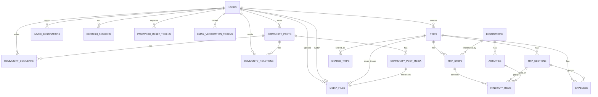

# GlobeTrotter — Database Design Document

> **Database:** PostgreSQL 16 (Docker) · **ORM:** Prisma · **PKs:** UUID · **20 Tables**  
> **Related Files:** [security_layer.md](file:///c:/Users/shakt/Downloads/oddo/security_layer.md) · [api_design.md](file:///c:/Users/shakt/Downloads/oddo/api_design.md) · [phases.md](file:///c:/Users/shakt/Downloads/oddo/phases.md)

---

## Design Principles

| Principle | Rule |
|---|---|
| **Normalized** | No duplicate data. Derived values (budget totals, popular cities) are calculated at query time via `SUM()` / `COUNT()` / `GROUP BY`. |
| **Constrained** | Every table has CHECK, UNIQUE, FK, NOT NULL constraints enforcing integrity at the DB level. |
| **Indexed** | Every frequently queried column (FKs, status, dates, search fields) has an index. |
| **Timestamped** | Every table has `created_at` and `updated_at`. |
| **Soft Delete** | User-owned mutable data (users, trips, sections, community posts/comments) uses `deleted_at`. |
| **UUID Primary Keys** | Prevents enumeration attacks. Never sequential integers. |
| **RLS-Protected** | Every table has Row-Level Security. See [security_layer.md](file:///c:/Users/shakt/Downloads/oddo/security_layer.md). |
| **Audit-Logged** | Every security-sensitive write is logged. See [security_layer.md](file:///c:/Users/shakt/Downloads/oddo/security_layer.md). |

### Tables That Are NOT Created (Derived Views)

> These are **never** stored as tables. They are queries.

| Concept | Derived From |
|---|---|
| Previous Trips | `SELECT * FROM trips WHERE status = 'completed' AND user_id = ?` |
| Upcoming Trips | `SELECT * FROM trips WHERE status = 'planned' AND start_date > NOW() AND user_id = ?` |
| Ongoing Trips | `SELECT * FROM trips WHERE status = 'ongoing' AND user_id = ?` |
| Calendar View | `trips` + `trip_stops` + `itinerary_items` joined by dates |
| Budget Summary | `SUM(expenses.amount) GROUP BY category WHERE trip_id = ?` |
| Daily Budget | `SUM(expenses.amount) GROUP BY expense_date WHERE trip_id = ?` |
| Per-Section Budget | `SUM(expenses.amount) WHERE trip_section_id = ?` vs `trip_sections.planned_budget` |
| Popular Cities | `COUNT(trip_stops.destination_id) GROUP BY destination_id ORDER BY count DESC` |
| Popular Activities | `COUNT(itinerary_items.activity_id) GROUP BY activity_id ORDER BY count DESC` |

---

## Table Index (20 Tables)

| # | Table | Type | Owner | Soft Delete |
|---|---|---|---|---|
| 1 | `users` | Core | Self | Yes |
| 2 | `media_files` | Core | User | Yes |
| 3 | `trips` | Core | User | Yes |
| 4 | `destinations` | Reference (Seeded) | System | No |
| 5 | `trip_stops` | Core | User (via trip) | No |
| 6 | `trip_sections` | Core | User (via trip) | Yes |
| 7 | `activities` | Reference (Seeded) | System | No |
| 8 | `itinerary_items` | Core | User (via trip>stop) | No |
| 9 | `expenses` | Core | User (via trip) | No |
| 10 | `shared_trips` | Core | User (via trip) | No |
| 11 | `saved_destinations` | Core | User | No |
| 12 | `community_posts` | Community | User | Yes |
| 13 | `community_comments` | Community | User | Yes |
| 14 | `community_reactions` | Community | User | No |
| 15 | `community_post_media` | Community | User (via post) | No |
| 16 | `refresh_sessions` | Auth | User | No |
| 17 | `password_reset_tokens` | Auth | System | No |
| 18 | `email_verification_tokens` | Auth | System | No |
| 19 | `analytics_events` | Analytics | System | No |
| 20 | `audit_logs` | Security | System (append-only) | No |

---

## Entity Relationship Diagram



---

## Complete Ownership Model

```text
                         +---------------+
                         |     USERS     |
                         +-------+-------+
                                 |
     +----------+--------+-------+-------+----------+----------+
     |          |        |       |       |          |          |
     v          v        v       v       v          v          v
  SAVED     REFRESH   MEDIA   TRIPS  COMMUNITY  ANALYTICS  AUTH
  DESTS     SESSIONS  FILES     |     POSTS      EVENTS     TOKENS
                        ^       |       |
                        |       |       +-- COMMENTS
                        |       |       +-- REACTIONS
                        |       |       +-- POST_MEDIA -> MEDIA_FILES
                (avatar)(cover) |
                                |
              +-----------------+--+--+--------+
              |                 |  |  |        |
              v                 v  |  v        v
         TRIP_STOPS      SECTIONS  |  EXPENSES SHARED_TRIPS
              |                 |  |
              v                 |  |
         ITINERARY_ITEMS <------+  |
              |                    |
              +-------- EXPENSES <-+

     DESTINATIONS <-- TRIP_STOPS
          |
       ACTIVITIES <-- ITINERARY_ITEMS
```

---

## Complete SQL Schema (DDL)

### Table 1: `media_files`

> This table MUST be created before `users` and `trips` because both reference it via FK.

```sql
CREATE TABLE media_files (
    id                UUID PRIMARY KEY DEFAULT gen_random_uuid(),
    owner_user_id     UUID NOT NULL,
    storage_key       TEXT NOT NULL UNIQUE,
    original_filename VARCHAR(255) NOT NULL,
    mime_type         VARCHAR(100) NOT NULL CHECK (mime_type IN ('image/jpeg','image/png','image/webp')),
    file_size         BIGINT NOT NULL CHECK (file_size > 0 AND file_size <= 5242880),
    checksum          VARCHAR(64),
    created_at        TIMESTAMPTZ DEFAULT NOW(),
    deleted_at        TIMESTAMPTZ
);

CREATE INDEX idx_media_files_owner ON media_files(owner_user_id);
CREATE INDEX idx_media_files_storage_key ON media_files(storage_key);
```

### Table 2: `users`

```sql
CREATE TABLE users (
    id                UUID PRIMARY KEY DEFAULT gen_random_uuid(),
    email             VARCHAR(255) NOT NULL UNIQUE,
    password_hash     VARCHAR(255) NOT NULL,
    first_name        VARCHAR(100) NOT NULL,
    last_name         VARCHAR(100) NOT NULL,
    bio               TEXT,
    phone             VARCHAR(20),
    city              VARCHAR(100),
    country           VARCHAR(100),
    avatar_file_id    UUID REFERENCES media_files(id) ON DELETE SET NULL,
    language          VARCHAR(10) DEFAULT 'en',
    role              VARCHAR(10) DEFAULT 'user' CHECK (role IN ('user', 'admin')),
    email_verified    BOOLEAN DEFAULT FALSE,
    email_verified_at TIMESTAMPTZ,
    created_at        TIMESTAMPTZ DEFAULT NOW(),
    updated_at        TIMESTAMPTZ DEFAULT NOW(),
    deleted_at        TIMESTAMPTZ
);

ALTER TABLE media_files ADD CONSTRAINT fk_media_owner
    FOREIGN KEY (owner_user_id) REFERENCES users(id) ON DELETE CASCADE;

CREATE INDEX idx_users_email ON users(email);
CREATE INDEX idx_users_role ON users(role);
```

### Table 3: `trips`

```sql
CREATE TABLE trips (
    id                  UUID PRIMARY KEY DEFAULT gen_random_uuid(),
    user_id             UUID NOT NULL REFERENCES users(id) ON DELETE CASCADE,
    title               VARCHAR(200) NOT NULL,
    description         TEXT,
    start_date          DATE NOT NULL,
    end_date            DATE NOT NULL,
    budget_limit        DECIMAL(12,2) CHECK (budget_limit >= 0),
    currency            VARCHAR(3) DEFAULT 'INR' CHECK (currency IN ('INR','USD','EUR','GBP','JPY','AUD','CAD')),
    cover_file_id       UUID REFERENCES media_files(id) ON DELETE SET NULL,
    status              VARCHAR(20) DEFAULT 'draft' CHECK (status IN ('draft','planned','ongoing','completed')),
    copied_from_trip_id UUID REFERENCES trips(id) ON DELETE SET NULL,
    created_at          TIMESTAMPTZ DEFAULT NOW(),
    updated_at          TIMESTAMPTZ DEFAULT NOW(),
    deleted_at          TIMESTAMPTZ,

    CONSTRAINT chk_trip_dates CHECK (end_date >= start_date)
);

CREATE INDEX idx_trips_user_id ON trips(user_id);
CREATE INDEX idx_trips_status ON trips(status);
CREATE INDEX idx_trips_start_date ON trips(start_date);
CREATE INDEX idx_trips_deleted_at ON trips(deleted_at) WHERE deleted_at IS NULL;
```

### Table 4: `destinations`

```sql
CREATE TABLE destinations (
    id               UUID PRIMARY KEY DEFAULT gen_random_uuid(),
    name             VARCHAR(200) NOT NULL,
    country          VARCHAR(100) NOT NULL,
    country_code     VARCHAR(3),
    region           VARCHAR(100),
    latitude         DECIMAL(10,7),
    longitude        DECIMAL(10,7),
    timezone         VARCHAR(50),
    description      TEXT,
    image_url        TEXT,
    cost_index       INT CHECK (cost_index BETWEEN 1 AND 5),
    popularity_score INT DEFAULT 0,
    created_at       TIMESTAMPTZ DEFAULT NOW(),
    updated_at       TIMESTAMPTZ DEFAULT NOW()
);

CREATE INDEX idx_destinations_country ON destinations(country);
CREATE INDEX idx_destinations_name ON destinations(name);
CREATE INDEX idx_destinations_region ON destinations(region);
```

### Table 5: `trip_stops`

```sql
CREATE TABLE trip_stops (
    id              UUID PRIMARY KEY DEFAULT gen_random_uuid(),
    trip_id         UUID NOT NULL REFERENCES trips(id) ON DELETE CASCADE,
    destination_id  UUID NOT NULL REFERENCES destinations(id) ON DELETE RESTRICT,
    stop_order      INT NOT NULL CHECK (stop_order >= 0),
    arrival_date    DATE NOT NULL,
    departure_date  DATE NOT NULL,
    notes           TEXT,
    created_at      TIMESTAMPTZ DEFAULT NOW(),
    updated_at      TIMESTAMPTZ DEFAULT NOW(),

    CONSTRAINT chk_stop_dates CHECK (departure_date >= arrival_date),
    CONSTRAINT uq_trip_stop_order UNIQUE (trip_id, stop_order)
);

CREATE INDEX idx_trip_stops_trip_id ON trip_stops(trip_id);
CREATE INDEX idx_trip_stops_destination_id ON trip_stops(destination_id);
```

### Table 6: `trip_sections`

```sql
CREATE TABLE trip_sections (
    id              UUID PRIMARY KEY DEFAULT gen_random_uuid(),
    trip_id         UUID NOT NULL REFERENCES trips(id) ON DELETE CASCADE,
    trip_stop_id    UUID REFERENCES trip_stops(id) ON DELETE SET NULL,
    title           VARCHAR(200) NOT NULL,
    description     TEXT,
    section_type    VARCHAR(20) NOT NULL CHECK (section_type IN ('travel','stay','activity','food','transport','custom')),
    start_date      DATE NOT NULL,
    end_date        DATE NOT NULL,
    planned_budget  DECIMAL(12,2) CHECK (planned_budget >= 0),
    currency        VARCHAR(3) DEFAULT 'INR',
    section_order   INT NOT NULL CHECK (section_order >= 0),
    created_at      TIMESTAMPTZ DEFAULT NOW(),
    updated_at      TIMESTAMPTZ DEFAULT NOW(),
    deleted_at      TIMESTAMPTZ,

    CONSTRAINT chk_section_dates CHECK (end_date >= start_date),
    CONSTRAINT uq_trip_section_order UNIQUE (trip_id, section_order)
);

CREATE INDEX idx_trip_sections_trip_id ON trip_sections(trip_id);
CREATE INDEX idx_trip_sections_trip_stop_id ON trip_sections(trip_stop_id);
CREATE INDEX idx_trip_sections_type ON trip_sections(section_type);
```

### Table 7: `activities`

```sql
CREATE TABLE activities (
    id               UUID PRIMARY KEY DEFAULT gen_random_uuid(),
    destination_id   UUID NOT NULL REFERENCES destinations(id) ON DELETE CASCADE,
    name             VARCHAR(300) NOT NULL,
    description      TEXT,
    category         VARCHAR(50) CHECK (category IN ('sightseeing','food','adventure','culture','nightlife','shopping','nature','other')),
    estimated_cost   DECIMAL(10,2) CHECK (estimated_cost >= 0),
    currency         VARCHAR(3) DEFAULT 'INR',
    duration_minutes INT CHECK (duration_minutes > 0),
    image_url        TEXT,
    rating           DECIMAL(2,1) CHECK (rating BETWEEN 0.0 AND 5.0),
    created_at       TIMESTAMPTZ DEFAULT NOW(),
    updated_at       TIMESTAMPTZ DEFAULT NOW()
);

CREATE INDEX idx_activities_destination_id ON activities(destination_id);
CREATE INDEX idx_activities_category ON activities(category);
```

### Table 8: `itinerary_items`

```sql
CREATE TABLE itinerary_items (
    id                  UUID PRIMARY KEY DEFAULT gen_random_uuid(),
    trip_stop_id        UUID NOT NULL REFERENCES trip_stops(id) ON DELETE CASCADE,
    trip_section_id     UUID REFERENCES trip_sections(id) ON DELETE SET NULL,
    activity_id         UUID REFERENCES activities(id) ON DELETE SET NULL,
    item_date           DATE NOT NULL,
    start_time          TIME,
    end_time            TIME,
    item_order          INT NOT NULL CHECK (item_order >= 0),
    custom_title        VARCHAR(300),
    custom_description  TEXT,
    notes               TEXT,
    created_at          TIMESTAMPTZ DEFAULT NOW(),
    updated_at          TIMESTAMPTZ DEFAULT NOW(),

    CONSTRAINT chk_time_order CHECK (end_time IS NULL OR start_time IS NULL OR end_time > start_time),
    CONSTRAINT uq_stop_date_order UNIQUE (trip_stop_id, item_date, item_order)
);

CREATE INDEX idx_itinerary_items_trip_stop_id ON itinerary_items(trip_stop_id);
CREATE INDEX idx_itinerary_items_trip_section_id ON itinerary_items(trip_section_id);
CREATE INDEX idx_itinerary_items_date ON itinerary_items(item_date);
CREATE INDEX idx_itinerary_items_activity_id ON itinerary_items(activity_id);
```

### Table 9: `expenses`

```sql
CREATE TABLE expenses (
    id                  UUID PRIMARY KEY DEFAULT gen_random_uuid(),
    trip_id             UUID NOT NULL REFERENCES trips(id) ON DELETE CASCADE,
    trip_stop_id        UUID REFERENCES trip_stops(id) ON DELETE SET NULL,
    trip_section_id     UUID REFERENCES trip_sections(id) ON DELETE SET NULL,
    itinerary_item_id   UUID REFERENCES itinerary_items(id) ON DELETE SET NULL,
    title               VARCHAR(200) NOT NULL,
    amount              DECIMAL(12,2) NOT NULL CHECK (amount >= 0),
    currency            VARCHAR(3) DEFAULT 'INR',
    category            VARCHAR(20) NOT NULL CHECK (category IN ('transport','stay','activities','meals','other')),
    expense_date        DATE NOT NULL,
    notes               TEXT,
    created_at          TIMESTAMPTZ DEFAULT NOW(),
    updated_at          TIMESTAMPTZ DEFAULT NOW()
);

CREATE INDEX idx_expenses_trip_id ON expenses(trip_id);
CREATE INDEX idx_expenses_trip_section_id ON expenses(trip_section_id);
CREATE INDEX idx_expenses_category ON expenses(category);
CREATE INDEX idx_expenses_date ON expenses(expense_date);
```

### Table 10: `shared_trips`

```sql
CREATE TABLE shared_trips (
    id          UUID PRIMARY KEY DEFAULT gen_random_uuid(),
    trip_id     UUID NOT NULL REFERENCES trips(id) ON DELETE CASCADE,
    share_token VARCHAR(16) NOT NULL UNIQUE,
    is_active   BOOLEAN DEFAULT TRUE,
    visibility  VARCHAR(20) DEFAULT 'link_only' CHECK (visibility IN ('public','link_only')),
    expires_at  TIMESTAMPTZ,
    created_at  TIMESTAMPTZ DEFAULT NOW()
);

CREATE INDEX idx_shared_trips_share_token ON shared_trips(share_token);
CREATE INDEX idx_shared_trips_trip_id ON shared_trips(trip_id);
CREATE INDEX idx_shared_trips_public ON shared_trips(visibility) WHERE visibility = 'public' AND is_active = TRUE;
```

### Table 11: `saved_destinations`

```sql
CREATE TABLE saved_destinations (
    id              UUID PRIMARY KEY DEFAULT gen_random_uuid(),
    user_id         UUID NOT NULL REFERENCES users(id) ON DELETE CASCADE,
    destination_id  UUID NOT NULL REFERENCES destinations(id) ON DELETE CASCADE,
    notes           TEXT,
    created_at      TIMESTAMPTZ DEFAULT NOW(),

    CONSTRAINT uq_user_dest UNIQUE (user_id, destination_id)
);

CREATE INDEX idx_saved_destinations_user_id ON saved_destinations(user_id);
```

### Table 12: `community_posts`

```sql
CREATE TABLE community_posts (
    id              UUID PRIMARY KEY DEFAULT gen_random_uuid(),
    user_id         UUID NOT NULL REFERENCES users(id) ON DELETE CASCADE,
    trip_id         UUID REFERENCES trips(id) ON DELETE SET NULL,
    destination_id  UUID REFERENCES destinations(id) ON DELETE SET NULL,
    activity_id     UUID REFERENCES activities(id) ON DELETE SET NULL,
    title           VARCHAR(300) NOT NULL,
    content         TEXT NOT NULL,
    visibility      VARCHAR(20) DEFAULT 'public' CHECK (visibility IN ('public','private','friends')),
    created_at      TIMESTAMPTZ DEFAULT NOW(),
    updated_at      TIMESTAMPTZ DEFAULT NOW(),
    deleted_at      TIMESTAMPTZ
);

CREATE INDEX idx_community_posts_user_id ON community_posts(user_id);
CREATE INDEX idx_community_posts_trip_id ON community_posts(trip_id);
CREATE INDEX idx_community_posts_destination_id ON community_posts(destination_id);
CREATE INDEX idx_community_posts_visibility ON community_posts(visibility) WHERE visibility = 'public';
CREATE INDEX idx_community_posts_created_at ON community_posts(created_at DESC);
```

### Table 13: `community_comments`

```sql
CREATE TABLE community_comments (
    id                  UUID PRIMARY KEY DEFAULT gen_random_uuid(),
    post_id             UUID NOT NULL REFERENCES community_posts(id) ON DELETE CASCADE,
    user_id             UUID NOT NULL REFERENCES users(id) ON DELETE CASCADE,
    parent_comment_id   UUID REFERENCES community_comments(id) ON DELETE CASCADE,
    content             TEXT NOT NULL,
    created_at          TIMESTAMPTZ DEFAULT NOW(),
    updated_at          TIMESTAMPTZ DEFAULT NOW(),
    deleted_at          TIMESTAMPTZ
);

CREATE INDEX idx_community_comments_post_id ON community_comments(post_id);
CREATE INDEX idx_community_comments_user_id ON community_comments(user_id);
CREATE INDEX idx_community_comments_parent ON community_comments(parent_comment_id);
```

### Table 14: `community_reactions`

```sql
CREATE TABLE community_reactions (
    id              UUID PRIMARY KEY DEFAULT gen_random_uuid(),
    post_id         UUID NOT NULL REFERENCES community_posts(id) ON DELETE CASCADE,
    user_id         UUID NOT NULL REFERENCES users(id) ON DELETE CASCADE,
    reaction_type   VARCHAR(20) DEFAULT 'like' CHECK (reaction_type IN ('like','love','inspire','helpful')),
    created_at      TIMESTAMPTZ DEFAULT NOW(),

    CONSTRAINT uq_post_user_reaction UNIQUE (post_id, user_id)
);

CREATE INDEX idx_community_reactions_post_id ON community_reactions(post_id);
CREATE INDEX idx_community_reactions_user_id ON community_reactions(user_id);
```

### Table 15: `community_post_media`

```sql
CREATE TABLE community_post_media (
    id              UUID PRIMARY KEY DEFAULT gen_random_uuid(),
    post_id         UUID NOT NULL REFERENCES community_posts(id) ON DELETE CASCADE,
    media_file_id   UUID NOT NULL REFERENCES media_files(id) ON DELETE CASCADE,
    display_order   INT NOT NULL CHECK (display_order >= 0),
    created_at      TIMESTAMPTZ DEFAULT NOW(),

    CONSTRAINT uq_post_media_order UNIQUE (post_id, display_order)
);

CREATE INDEX idx_community_post_media_post_id ON community_post_media(post_id);
```

### Table 16: `refresh_sessions`

```sql
CREATE TABLE refresh_sessions (
    id          UUID PRIMARY KEY DEFAULT gen_random_uuid(),
    user_id     UUID NOT NULL REFERENCES users(id) ON DELETE CASCADE,
    token_hash  VARCHAR(255) NOT NULL UNIQUE,
    family_id   UUID NOT NULL,
    device_info VARCHAR(255),
    ip_address  VARCHAR(45),
    expires_at  TIMESTAMPTZ NOT NULL,
    revoked_at  TIMESTAMPTZ,
    replaced_by UUID REFERENCES refresh_sessions(id) ON DELETE SET NULL,
    created_at  TIMESTAMPTZ DEFAULT NOW(),
    last_used_at TIMESTAMPTZ DEFAULT NOW()
);

CREATE INDEX idx_refresh_sessions_user_id ON refresh_sessions(user_id);
CREATE INDEX idx_refresh_sessions_token_hash ON refresh_sessions(token_hash);
CREATE INDEX idx_refresh_sessions_family_id ON refresh_sessions(family_id);
```

### Table 17: `password_reset_tokens`

```sql
CREATE TABLE password_reset_tokens (
    id          UUID PRIMARY KEY DEFAULT gen_random_uuid(),
    user_id     UUID NOT NULL REFERENCES users(id) ON DELETE CASCADE,
    token_hash  VARCHAR(255) NOT NULL UNIQUE,
    expires_at  TIMESTAMPTZ NOT NULL,
    is_used     BOOLEAN DEFAULT FALSE,
    created_at  TIMESTAMPTZ DEFAULT NOW()
);

CREATE INDEX idx_prt_user_id ON password_reset_tokens(user_id);
CREATE INDEX idx_prt_token_hash ON password_reset_tokens(token_hash);
```

### Table 18: `email_verification_tokens`

```sql
CREATE TABLE email_verification_tokens (
    id          UUID PRIMARY KEY DEFAULT gen_random_uuid(),
    user_id     UUID NOT NULL REFERENCES users(id) ON DELETE CASCADE,
    token_hash  VARCHAR(255) NOT NULL UNIQUE,
    expires_at  TIMESTAMPTZ NOT NULL,
    is_used     BOOLEAN DEFAULT FALSE,
    created_at  TIMESTAMPTZ DEFAULT NOW()
);

CREATE INDEX idx_evt_user_id ON email_verification_tokens(user_id);
CREATE INDEX idx_evt_token_hash ON email_verification_tokens(token_hash);
```

### Table 19: `analytics_events`

```sql
CREATE TABLE analytics_events (
    id          UUID PRIMARY KEY DEFAULT gen_random_uuid(),
    user_id     UUID REFERENCES users(id) ON DELETE SET NULL,
    event_type  VARCHAR(50) NOT NULL,
    entity_type VARCHAR(50),
    entity_id   UUID,
    metadata    JSONB,
    created_at  TIMESTAMPTZ DEFAULT NOW()
);

CREATE INDEX idx_analytics_event_type ON analytics_events(event_type);
CREATE INDEX idx_analytics_entity ON analytics_events(entity_type, entity_id);
CREATE INDEX idx_analytics_created_at ON analytics_events(created_at);
CREATE INDEX idx_analytics_user_id ON analytics_events(user_id);
```

**Event types:** `DESTINATION_SEARCHED`, `DESTINATION_VIEWED`, `ACTIVITY_VIEWED`, `TRIP_CREATED`, `TRIP_COMPLETED`, `COMMUNITY_POST_CREATED`, `COMMUNITY_POST_VIEWED`, `SHARE_LINK_OPENED`

### Table 20: `audit_logs`

```sql
CREATE TABLE audit_logs (
    id              UUID PRIMARY KEY DEFAULT gen_random_uuid(),
    actor_user_id   UUID REFERENCES users(id) ON DELETE SET NULL,
    action          VARCHAR(50) NOT NULL,
    resource_type   VARCHAR(50) NOT NULL,
    resource_id     UUID,
    request_id      VARCHAR(50),
    ip_address      VARCHAR(45),
    user_agent      TEXT,
    old_values      JSONB,
    new_values      JSONB,
    metadata        JSONB,
    created_at      TIMESTAMPTZ DEFAULT NOW()
);

CREATE INDEX idx_audit_logs_actor ON audit_logs(actor_user_id);
CREATE INDEX idx_audit_logs_action ON audit_logs(action);
CREATE INDEX idx_audit_logs_resource ON audit_logs(resource_type, resource_id);
CREATE INDEX idx_audit_logs_request_id ON audit_logs(request_id);
CREATE INDEX idx_audit_logs_created_at ON audit_logs(created_at);
```

**Audit actions:** `LOGIN_SUCCESS`, `LOGIN_FAILED`, `LOGOUT`, `PASSWORD_CHANGED`, `PASSWORD_RESET_REQ`, `PASSWORD_RESET_DONE`, `EMAIL_VERIFIED`, `REFRESH_TOKEN_REUSE`, `TRIP_CREATED`, `TRIP_UPDATED`, `TRIP_DELETED`, `STOP_CREATED`, `STOP_UPDATED`, `STOP_DELETED`, `SECTION_CREATED`, `SECTION_UPDATED`, `SECTION_DELETED`, `ITEM_CREATED`, `ITEM_UPDATED`, `ITEM_DELETED`, `EXPENSE_CREATED`, `EXPENSE_UPDATED`, `EXPENSE_DELETED`, `SHARE_CREATED`, `SHARE_REVOKED`, `TRIP_COPIED`, `ADMIN_ROLE_CHANGED`, `ADMIN_USER_DELETED`, `ACCOUNT_DELETED`, `FILE_UPLOADED`, `FILE_DELETED`, `POST_CREATED`, `POST_DELETED`, `COMMENT_CREATED`, `COMMENT_DELETED`

---

## Orphan Record Protection (FK + ON DELETE)

| # | Child | Parent | FK Column | ON DELETE | Rationale |
|---|---|---|---|---|---|
| 1 | `media_files` | `users` | `owner_user_id` | `CASCADE` | Delete user -> delete files |
| 2 | `users` | `media_files` | `avatar_file_id` | `SET NULL` | Delete file -> clear avatar |
| 3 | `trips` | `users` | `user_id` | `CASCADE` | Delete user -> delete trips |
| 4 | `trips` | `media_files` | `cover_file_id` | `SET NULL` | Delete file -> clear cover |
| 5 | `trips` | `trips` | `copied_from_trip_id` | `SET NULL` | Delete source -> keep copy |
| 6 | `trip_stops` | `trips` | `trip_id` | `CASCADE` | Delete trip -> delete stops |
| 7 | `trip_stops` | `destinations` | `destination_id` | `RESTRICT` | Can't delete destination in use |
| 8 | `trip_sections` | `trips` | `trip_id` | `CASCADE` | Delete trip -> delete sections |
| 9 | `trip_sections` | `trip_stops` | `trip_stop_id` | `SET NULL` | Delete stop -> unlink section |
| 10 | `itinerary_items` | `trip_stops` | `trip_stop_id` | `CASCADE` | Delete stop -> delete items |
| 11 | `itinerary_items` | `trip_sections` | `trip_section_id` | `SET NULL` | Delete section -> unlink |
| 12 | `itinerary_items` | `activities` | `activity_id` | `SET NULL` | Delete activity -> keep item |
| 13 | `expenses` | `trips` | `trip_id` | `CASCADE` | Delete trip -> delete expenses |
| 14 | `expenses` | `trip_sections` | `trip_section_id` | `SET NULL` | Delete section -> keep expense |
| 15 | `expenses` | `itinerary_items` | `itinerary_item_id` | `SET NULL` | Delete item -> keep expense |
| 16 | `shared_trips` | `trips` | `trip_id` | `CASCADE` | Delete trip -> delete shares |
| 17 | `saved_destinations` | `users` | `user_id` | `CASCADE` | Delete user -> delete saves |
| 18 | `saved_destinations` | `destinations` | `destination_id` | `CASCADE` | Delete dest -> delete saves |
| 19 | `community_posts` | `users` | `user_id` | `CASCADE` | Delete user -> delete posts |
| 20 | `community_posts` | `trips` | `trip_id` | `SET NULL` | Delete trip -> keep post |
| 21 | `community_comments` | `community_posts` | `post_id` | `CASCADE` | Delete post -> delete comments |
| 22 | `community_comments` | `users` | `user_id` | `CASCADE` | Delete user -> delete comments |
| 23 | `community_comments` | `community_comments` | `parent_comment_id` | `CASCADE` | Delete parent -> delete replies |
| 24 | `community_reactions` | `community_posts` | `post_id` | `CASCADE` | Delete post -> delete reactions |
| 25 | `community_reactions` | `users` | `user_id` | `CASCADE` | Delete user -> delete reactions |
| 26 | `community_post_media` | `community_posts` | `post_id` | `CASCADE` | Delete post -> delete media links |
| 27 | `community_post_media` | `media_files` | `media_file_id` | `CASCADE` | Delete file -> delete link |
| 28 | `refresh_sessions` | `users` | `user_id` | `CASCADE` | Delete user -> revoke sessions |
| 29 | `password_reset_tokens` | `users` | `user_id` | `CASCADE` | Delete user -> delete tokens |
| 30 | `email_verification_tokens` | `users` | `user_id` | `CASCADE` | Delete user -> delete tokens |
| 31 | `analytics_events` | `users` | `user_id` | `SET NULL` | Delete user -> keep analytics |
| 32 | `audit_logs` | `users` | `actor_user_id` | `SET NULL` | Delete user -> keep audit trail |

---

## Database Constraint Safety Net

| Question | Enforcement |
|---|---|
| Can a row exist without its parent? | FK constraints prevent orphans |
| Can an FK point nowhere? | `REFERENCES` enforces referential integrity |
| Can duplicates exist? | UNIQUE on: `email`, `share_token`, `storage_key`, `(user_id, destination_id)`, `(trip_id, stop_order)`, `(trip_id, section_order)`, `(trip_stop_id, item_date, item_order)`, `(post_id, user_id)` |
| Can negative values exist? | CHECK: `amount >= 0`, `budget_limit >= 0`, `planned_budget >= 0`, `estimated_cost >= 0`, `file_size > 0` |
| Can impossible states exist? | CHECK: `end_date >= start_date`, `departure_date >= arrival_date`, `end_time > start_time`, `cost_index BETWEEN 1 AND 5`, `rating BETWEEN 0.0 AND 5.0`, `file_size <= 5242880` |
| Can invalid enums exist? | CHECK on: `role`, `status`, `category`, `currency`, `visibility`, `section_type`, `mime_type`, `reaction_type` |

---

## Docker Compose

```yaml
version: '3.8'
services:
  postgres:
    image: postgres:16-alpine
    container_name: globetrotter-db
    environment:
      POSTGRES_DB: globetrotter
      POSTGRES_USER: globetrotter
      POSTGRES_PASSWORD: globetrotter_dev_pass
    ports:
      - "5432:5432"
    volumes:
      - pgdata:/var/lib/postgresql/data
    healthcheck:
      test: ["CMD-SHELL", "pg_isready -U globetrotter"]
      interval: 5s
      timeout: 5s
      retries: 5
volumes:
  pgdata:
```
